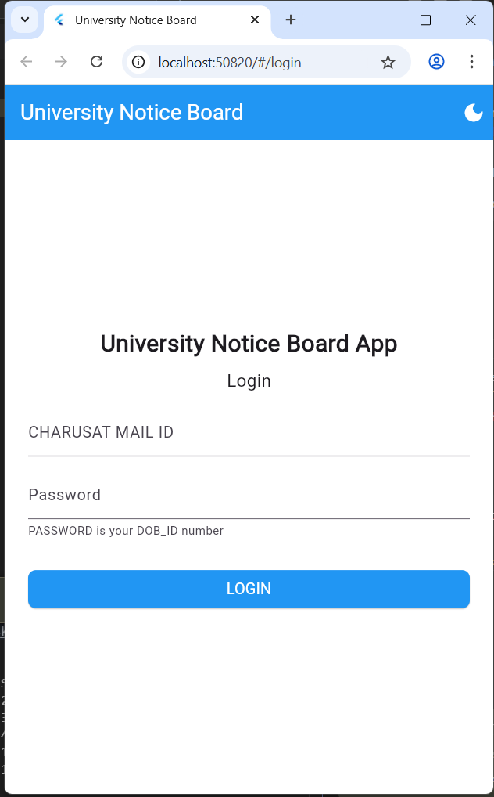
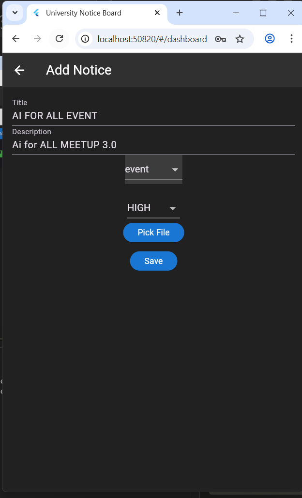

# University Notice Board App

The University Notice Board App is a comprehensive Flutter application designed to facilitate efficient communication between university administration and students. This application provides a modern, user-friendly interface for managing university notices, incorporating advanced features such as real-time search, category filtering, and a favorites system to enhance user experience and productivity.

## Features

### Authentication System
The application includes a secure authentication system that requires users to log in using their CHARUSAT email credentials. The password format follows a specific pattern combining date of birth and ID number. For demonstration purposes, the app includes a mock user database.

### Notice Management
Users can perform full CRUD operations on notices, including creating new notices with detailed information such as title, description, category, and priority level. The app supports editing existing notices while preserving all data, and provides safe deletion with confirmation dialogs. Additionally, users can attach documents and files to notices for comprehensive information sharing.

### Advanced Filtering and Search
The application offers powerful search and filtering capabilities. Users can perform real-time searches across notice titles, descriptions, and authors. Category-based filtering allows sorting by Exam, Event, Academic, or General notices. Priority levels are visually indicated, and a favorites system enables users to bookmark important notices for quick access.

### Modern User Interface and Experience
The app features a responsive design optimized for all screen sizes, with seamless switching between dark and light themes. Loading states provide visual feedback during operations, and the overall design follows clean, intuitive principles to ensure a professional user experience.

### Dashboard Analytics
The dashboard provides an overview of notice statistics, including breakdowns by category, author tracking, and timestamp information. Priority indicators offer visual cues for notice importance, helping users prioritize their attention effectively.

## Screenshots

### Login Page


### Dashboard


### Add Notice


### Event Details and Dark Mode


## Installation

### Prerequisites
Before installing the application, ensure you have the following prerequisites:
- Flutter SDK version 3.8.1 or higher
- Dart SDK
- Android Studio or Visual Studio Code
- An Android or iOS emulator, or a physical device for testing

### Setup Instructions

1. Clone the repository to your local machine:
   ```bash
   git clone https://github.com/OMCHOKSI108/university-notice-board.git
   cd university-notice-board
   ```

2. Install the required dependencies:
   ```bash
   flutter pub get
   ```

3. Run the application:
   ```bash
   flutter run
   ```

### Build Instructions

To build the application for release:

For Android APK:
```bash
flutter build apk --release
```

For iOS (macOS only):
```bash
flutter build ios --release
```

## Usage

### Login Credentials (Demo)
The application includes mock user accounts for testing purposes. The following table lists sample credentials:

| Email | Password | Format |
|-------|----------|--------|
| 23AIML010@charusat.edu.in | 14082006_23AIML010 | DDMMYYYY_ID |
| 23AIML047@charusat.edu.in | 19092005_23AIML047 | DDMMYYYY_ID |
| 23AIML123@charusat.edu.in | 05122004_23AIML123 | DDMMYYYY_ID |

### App Features Guide

1. Login: Enter your CHARUSAT email and DOB_ID password to access the application.
2. Dashboard: View all notices with available filtering options.
3. Search: Utilize the search bar to locate specific notices quickly.
4. Filter: Apply category filters or toggle the favorites view.
5. Add Notice: Use the add button to create new notices.
6. View Details: Tap on any notice to view its full details.
7. Edit/Delete: Access action buttons in the notice details for editing or deleting.
8. Theme: Switch between light and dark modes as preferred.

## Technologies Used

- Framework: Flutter
- Language: Dart
- State Management: Stateful Widgets
- Storage: SharedPreferences (Local)
- File Handling: File Picker
- UI Components: Material Design
- Architecture: MVC Pattern

## Dependencies

```yaml
dependencies:
  flutter:
    sdk: flutter
  shared_preferences: ^2.2.2
  file_picker: ^8.0.0+1
  uuid: ^4.2.1
  cupertino_icons: ^1.0.8
```

## Project Structure

```
lib/
├── main.dart                 # App entry point and theme management
├── login.dart                # Authentication screen
├── dashboard.dart            # Main dashboard with notice list
├── models/
│   └── notice.dart          # Notice data model
├── screens/
│   ├── add_notice.dart      # Add/Edit notice screen
│   └── notice_detail.dart   # Notice details screen
└── services/
    └── notice_service.dart  # Data persistence service
```

## Development

### Code Style
This project adheres to Flutter's recommended code style guidelines and incorporates:
- Static analysis using `flutter analyze`
- Proper error handling mechanisms
- Clean architecture principles

### Testing
Run the test suite with the following command:
```bash
flutter test
```

### Code Generation
Generate necessary code using:
```bash
flutter pub run build_runner build
```

## Contributing

Contributions to this project are welcome. To contribute:

1. Fork the repository.
2. Create a feature branch (`git checkout -b feature/AmazingFeature`).
3. Commit your changes (`git commit -m 'Add some AmazingFeature'`).
4. Push to the branch (`git push origin feature/AmazingFeature`).
5. Open a Pull Request.

## License

This project is licensed under the MIT License. See the [LICENSE](LICENSE) file for details.

## Author

**OM CHOKSI**
- GitHub: [@OMCHOKSI108](https://github.com/OMCHOKSI108)
- LinkedIn: [Your LinkedIn](https://linkedin.com/in/your-profile)

## Acknowledgments

- Flutter Team for providing the framework
- Material Design for UI inspiration
- CHARUSAT University for the project inspiration

For questions or support, please open an issue on GitHub.
